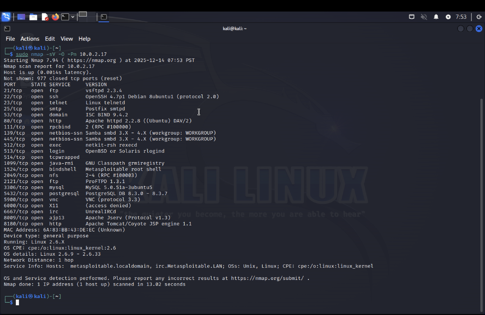
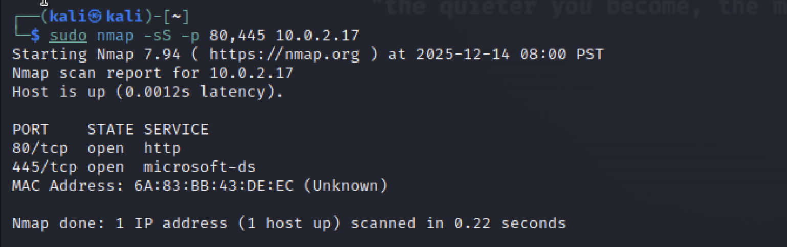
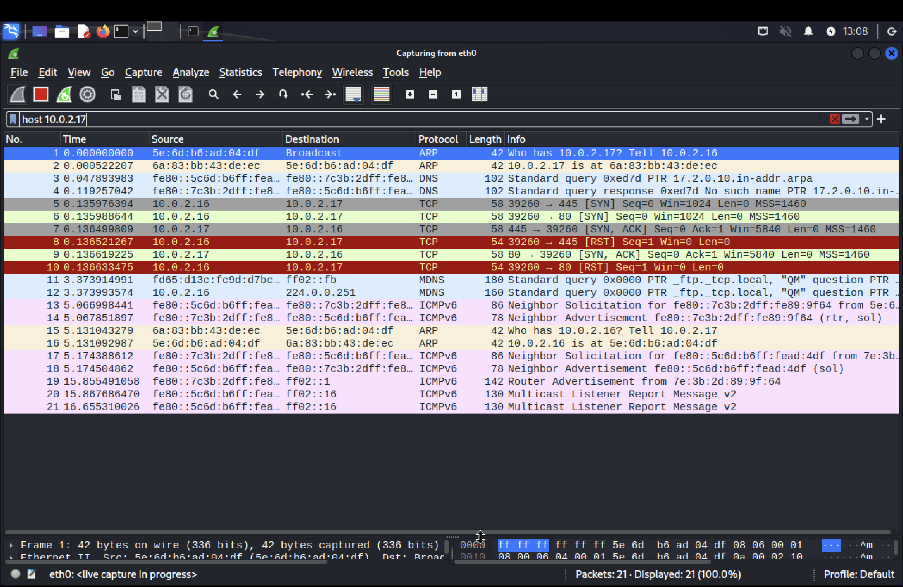
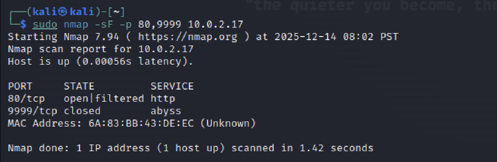
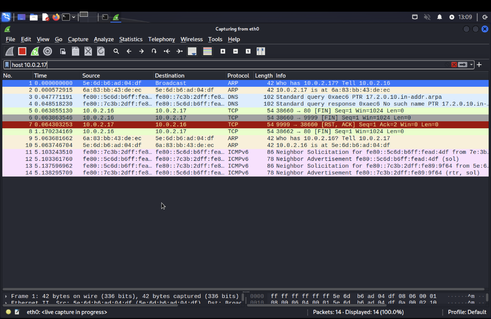
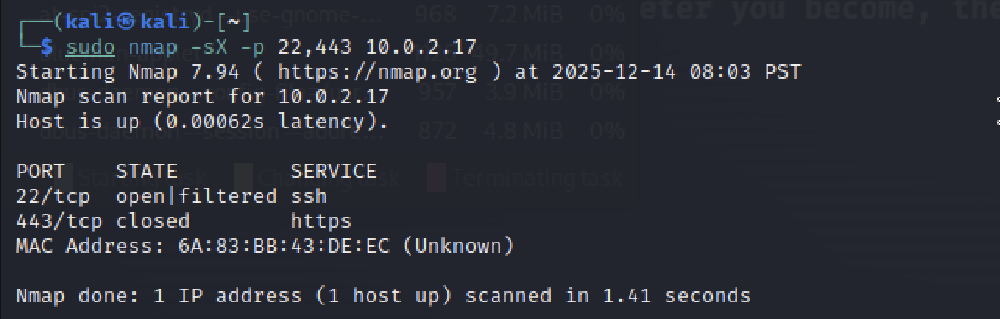
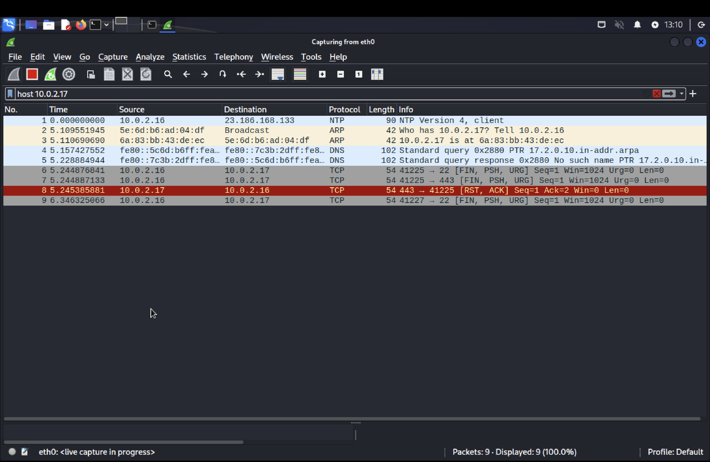
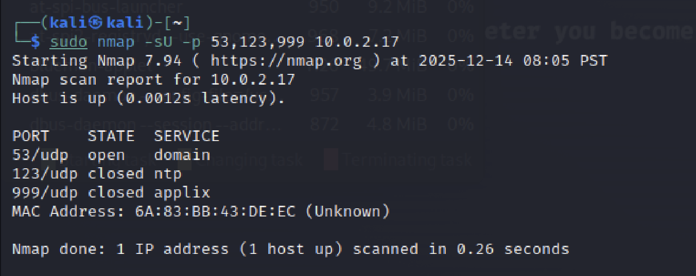
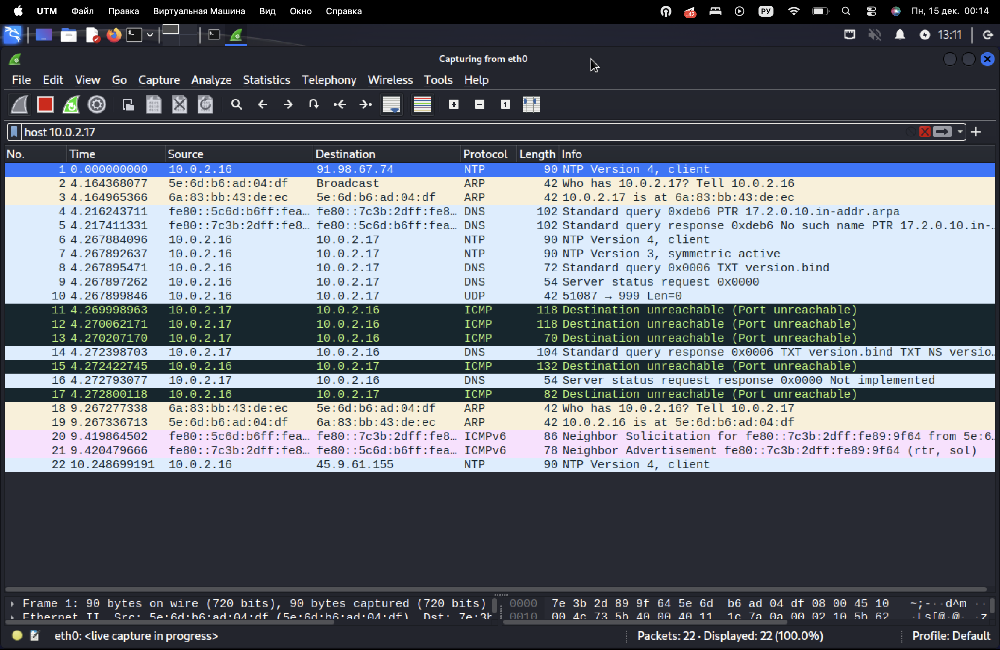

# Домашнее задание к занятию «Уязвимости и атаки на информационные системы»

**Выполнил:** Гридин Владимир  

---

## Задание 1. Сканирование Metasploitable и поиск уязвимостей

### 1.1 Установка Metasploitable
- Скачан образ `Metasploitable2-Linux.zip` со страницы  
  https://sourceforge.net/projects/metasploitable/
- Распакован и импортирован в UTM (сетевой адаптер – «Общая сеть»).
- IP-адрес атакуемой ВМ: `10.0.2.17`.

### 1.2 Быстрое сканирование nmap

```bash
sudo nmap -sV -O -Pn 10.0.2.17
```

Скриншот терминала:



### 1.3 Поиск уязвимостей на exploit-db.com

```Table

Служба	Версия	Найденная уязвимость	Ссылка на эксплойт
vsftpd	2.3.4	Backdoor командой «:)»	https://www.exploit-db.com/exploits/49757
Samba	3.0.20	Username map script RCE	https://www.exploit-db.com/exploits/16320
distccd	v1	Command injection	https://www.exploit-db.com/exploits/22243
```

## Задание 2. Сканирование в «тихих» режимах и анализ трафика Wireshark

### 2.1 Подготовка

Атакующая машина: Kali Linux (IP 10.0.2.16).
Цель: 10.0.2.17
Запущен Wireshark с фильтром host 10.0.2.17.

### 2.2 Сеансы сканирования

1) SYN-scan (полуполное рукопожатие)

```bash

sudo nmap -sS -p 80,445 10.0.2.17
```

Трафик: только SYN → SYN/ACK → RST (от нас).

Ответ сервера: нормальный SYN/ACK, RST отправляем мы сами.

Плюс: не создаёт записи в логах приложений.

Скриншот Wireshark:





2) FIN-scan ( stealth-режим, TCP FIN )

```bash

sudo nmap -sF -p 80,9999 10.0.2.17
```

Трафик: FIN → RST для закрытых портов; для открытых – вообще ничего (Linux).

Ответ сервера: RST только если порт закрыт; открытые порты молчат.

Вывод nmap: «open|filtered» – недостоверно для Linux.

Скриншот:





3) Xmas-scan (FIN+PSH+URG)

```bash

sudo nmap -sX -p 22,443 10.0.2.17
```

Поведение аналогично FIN-scan: RST при закрытом порте, тишина – при открытом.

Флаги в Wireshark: FIN, PSH, URG одновременно установлены.





4) UDP-scan

```bash

sudo nmap -sU -p 53,123,999 10.0.2.17
```

Трафик: UDP-датаграмма → ICMP-port-unreachable (если закрыт) или молчание (открыт/фильтруется).

Ответ сервера: ICMP Type 3 Code 3 для закрытых портов.

Скриншот:





### 2.3 Краткие выводы

```Table

Режим	Пакет-зонд	Ответ закрытого	Ответ открытого	Особенность
SYN	SYN	RST	SYN/ACK	Быстрее всего, логируется
FIN	FIN	RST	тишина	Не работает точно на Linux
Xmas	FIN+PSH+URG	RST	тишина	«ёлочка», тот же недостаток
UDP	UDP	ICMP Port-Unreach	тишина	Медленный, зависит от ICMP
```

---

